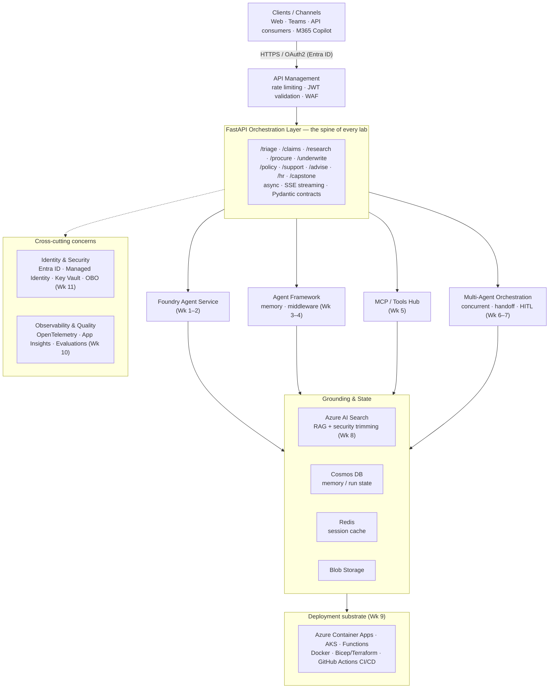

# Agentic AI on Azure — Enterprise Master Class (Starter Project)

[](https://github.com/satyajeetaiml-hue/azure-agentic-ai-masterclass/actions/workflows/ci.yml)

A production-oriented **FastAPI** starter for building agentic AI systems on Azure, structured to follow the
**12-Week Enterprise Master Class** (see [`docs/Course-Enterprise-UseCases.md`](docs/Course-Enterprise-UseCases.md)).

The project is designed so it **runs locally out of the box** (Week 1 "hello agent" works with a built-in mock
reasoning loop — no Azure keys required), and progressively layers in real Azure services week by week.

> Stack: **Python 3.11+ · FastAPI · Pydantic v2 · Uvicorn** · Microsoft Foundry · Microsoft Agent Framework ·
> MCP · A2A · Azure AI Search · Cosmos DB · Container Apps.

---

## 🏗️ Architecture

The "north star" you build toward across the 12 weeks. Each block is annotated with the week(s) that
implement it. (A plain-text version is in [`docs/Course-Enterprise-UseCases.md`](docs/Course-Enterprise-UseCases.md).)



---

## 📚 Lab index — one repo per week

This repo is the **course hub**. Each week is also published as a **standalone, runnable repo**.

> ✅ **All 12 weeks are fully built out** — every lab ships a runnable offline **mock backend**
> (deterministic, fully tested) plus a lazy-imported **real Azure backend** selected by env vars, with
> typed schemas, hermetic tests, a detailed README, Dockerfile, and green CI. **61 tests passing across
> all repos.** Clone any week and run `uvicorn app.main:app --reload`.

| Week | Lab repo | Enterprise use case | Key built-out feature | Status |
|------|----------|---------------------|-----------------------|:------:|
| **1** | [week01-foundations](https://github.com/satyajeetaiml-hue/agentic-ai-azure-week01-foundations) | IT Helpdesk Triage Agent | reason→plan→act→observe loop + Foundry Responses | ✅ Built out |
| **2** | [week02-foundry-claims](https://github.com/satyajeetaiml-hue/agentic-ai-azure-week02-foundry-claims) | Insurance Claims Intake | Foundry Agent Service **function tool** loop | ✅ Built out |
| **3–4** | [week03-04-agent-framework](https://github.com/satyajeetaiml-hue/agentic-ai-azure-week03-04-agent-framework) | Wealth Research Assistant | memory + middleware (PII/disclaimer) + tools | ✅ Built out |
| **5** | [week05-mcp-tools](https://github.com/satyajeetaiml-hue/agentic-ai-azure-week05-mcp-tools) | Procurement Operations Agent | tool registry + idempotency + MCP discovery | ✅ Built out |
| **6–7** | [week06-07-multi-agent](https://github.com/satyajeetaiml-hue/agentic-ai-azure-week06-07-multi-agent) | Loan Underwriting Pipeline | concurrent agents + human-in-the-loop resume | ✅ Built out |
| **8** | [week08-rag-grounding](https://github.com/satyajeetaiml-hue/agentic-ai-azure-week08-rag-grounding) | Clinical Policy Assistant (RAG) | retrieval + security trimming + citations | ✅ Built out |
| **9** | [week09-hosting-scale](https://github.com/satyajeetaiml-hue/agentic-ai-azure-week09-hosting-scale) | Customer Service Swarm | durable background tasks + status polling | ✅ Built out |
| **10** | [week10-observability](https://github.com/satyajeetaiml-hue/agentic-ai-azure-week10-observability) | Advice Quality Monitoring | eval scoring + metrics/traces + OTel | ✅ Built out |
| **11** | [week11-security](https://github.com/satyajeetaiml-hue/agentic-ai-azure-week11-security) | HR Self-Service (least privilege) | Entra JWT + OBO + RBAC + audit | ✅ Built out |
| **12** | [week12-capstone](https://github.com/satyajeetaiml-hue/agentic-ai-azure-week12-capstone) | Capstone onboarding pipeline | staged multi-agent pipeline | ✅ Built out |

Each lab endpoint is listed in its own README. Backends run in **mock mode** with no Azure; set the
documented env vars (+ `az login`) to switch to the real Azure backend.

> Browse them all: **https://github.com/satyajeetaiml-hue?tab=repositories&q=agentic-ai-azure**

---

## 🧪 Other agent frameworks (bonus projects)

The labs use the **Microsoft Agent Framework / Foundry**. These companion repos solve the same kind of
problem with the two other major frameworks, so you can compare APIs side by side. Both run **for real
offline** (the framework executes; Azure OpenAI is optional) and have green CI.

| Framework | Repo | What it shows |
|-----------|------|---------------|
| **LangGraph** | [agentic-ai-azure-langgraph](https://github.com/satyajeetaiml-hue/agentic-ai-azure-langgraph) | A `StateGraph` triage agent — nodes + conditional edges + state; optional Azure OpenAI node |
| **Semantic Kernel** | [agentic-ai-azure-semantic-kernel](https://github.com/satyajeetaiml-hue/agentic-ai-azure-semantic-kernel) | A `Kernel` + native plugin (`@kernel_function`); optional Azure automatic function calling |

📖 **[COMPARISON.md](COMPARISON.md)** — Microsoft Agent Framework vs. LangGraph vs. Semantic Kernel:
abstractions, control flow, state, tools, Azure fit, the same agent in each, and how to choose.

---

## Quick start

```bash
# 1. Create and activate a virtual environment
python -m venv .venv
# Windows (PowerShell):
.\.venv\Scripts\Activate.ps1
# macOS/Linux:
# source .venv/bin/activate

# 2. Install dependencies
pip install -r requirements.txt

# 3. Copy the env template (optional — app runs in MOCK mode without it)
copy .env.example .env        # Windows
# cp .env.example .env        # macOS/Linux

# 4. Run the API
uvicorn app.main:app --reload
```

Then open:

- Swagger UI: http://127.0.0.1:8000/docs
- Health check: http://127.0.0.1:8000/health
- Week 1 hello-agent: `POST http://127.0.0.1:8000/api/v1/hello`

Example request:

```bash
curl -X POST http://127.0.0.1:8000/api/v1/hello ^
  -H "Content-Type: application/json" ^
  -d "{\"message\": \"My laptop won't connect to VPN and it's urgent\"}"
```

---

## Project layout

```
azure-agentic-ai-masterclass/
├── app/
│   ├── main.py            # FastAPI application + router registration
│   ├── config.py          # Pydantic settings (reads .env)
│   ├── core/
│   │   ├── agent_loop.py  # reason → plan → act → observe loop (mock + Azure-ready)
│   │   └── logging.py     # structured logging setup
│   ├── routers/
│   │   ├── hello.py       # Week 1 — IT Helpdesk Triage Agent
│   │   └── health.py      # liveness/readiness
│   └── schemas/
│       └── agent.py       # Pydantic request/response contracts
├── labs/                  # one folder per course week with its own README & TODOs
│   ├── week01_foundations/
│   ├── week02_foundry/
│   └── ...
├── docs/
│   └── Course-Enterprise-UseCases.md   # the full course companion
├── infra/                 # Bicep IaC placeholders (Container Apps, etc.)
├── tests/                 # pytest suite
├── .github/workflows/ci.yml
├── Dockerfile
├── docker-compose.yml
├── requirements.txt
└── pyproject.toml
```

---

## Running with Docker

```bash
docker build -t azure-agentic-ai .
docker run -p 8000:8000 azure-agentic-ai
```

Or with compose:

```bash
docker compose up --build
```

---

## Configuration

All settings live in `app/config.py` and are read from environment variables / `.env`.
See [`.env.example`](.env.example) for the full list. If `AZURE_OPENAI_ENDPOINT` is **not** set,
the agent loop falls back to a deterministic **mock** so the app stays runnable for learning.

| Variable | Purpose |
|----------|---------|
| `APP_ENV` | `local` / `dev` / `prod` |
| `AZURE_OPENAI_ENDPOINT` | Azure OpenAI / Foundry endpoint (enables real model calls) |
| `AZURE_OPENAI_API_KEY` | Key (prefer Managed Identity in Azure) |
| `AZURE_OPENAI_DEPLOYMENT` | Chat model deployment name |

---

## The 12-week path

Each `labs/weekNN_*` folder maps to a week in the course companion and contains a `README.md`
with the learning goal, enterprise use case, and a hands-on TODO checklist. Start at
[`labs/week01_foundations`](labs/week01_foundations/README.md).

---

## Testing

```bash
pytest -q
```

---

## License

MIT — see [`LICENSE`](LICENSE).
